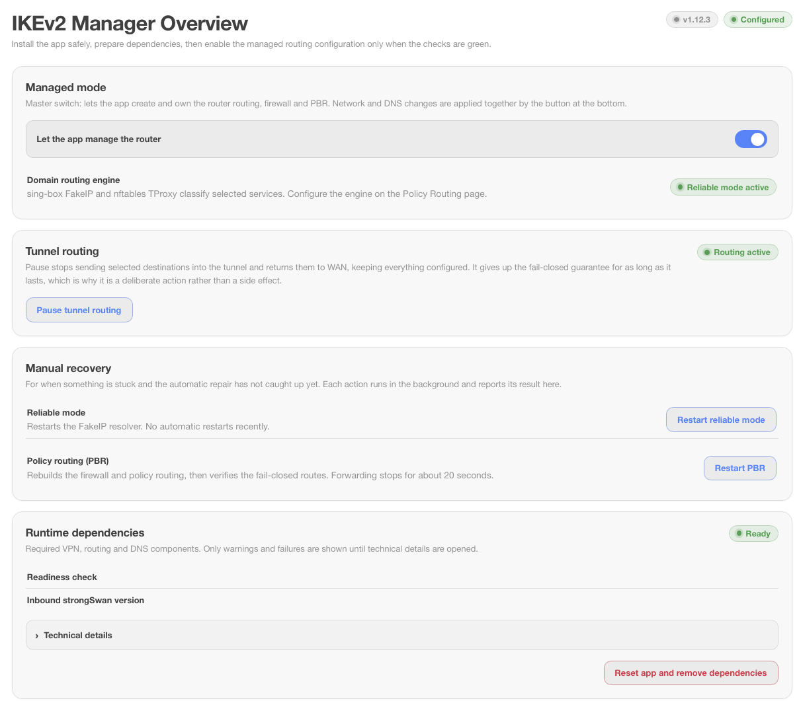

# IKEv2 Manager для OpenWrt

[English](README.md)

[](https://github.com/Nikitid/luci-app-ikev2-manager/actions/workflows/ci.yml)
[](https://github.com/Nikitid/luci-app-ikev2-manager/releases/latest)
[](LICENSE)

Пакет `luci-app-ikev2-manager` - LuCI-приложение для исходящего IKEv2-туннеля,
входящего IKEv2-сервера и выборочной маршрутизации IPv4-трафика в OpenWrt. В
качестве удалённого шлюза можно использовать [IKEv2 Manager для
Ubuntu](https://github.com/Nikitid/ikev2-ubuntu).



## Возможности

- исходящий IKEv2/EAP-клиент через XFRM-интерфейс;
- маршрутизация сервисов, доменов, IPv4-адресов и CIDR через VPN;
- режимы устройств: выбранные домены, весь трафик, прямой WAN, отдельные
  исключения DNS/DPI и пресет полного исключения из управления;
- FakeIP/TProxy для доменов и fail-closed PBR;
- входящий IKEv2/EAP-сервер с глобальными и индивидуальными правилами доступа
  пользователей к роутеру, отдельным публичным портам, Интернету и локальным
  IPv4-адресам;
- виджет состояния исходящего туннеля, PBR и активных входящих VPN-клиентов
  в Status -> Overview;
- DNS upstream через UDP, TCP, DoT, DoH, HTTP/3, DoQ или DNSCrypt, включая
  явный аварийный DNS от WAN-провайдера и независимые группы резолверов
  для заданных доменных суффиксов;
- профили входящих клиентов для Apple, Android и Windows VPNv2/NRPT, включая
  универсальное приложение Windows и отдельные профили VPNv2 XML без PowerShell;
- ACME и интерфейс LuCI на русском и английском языках.

## Требования

- официальный OpenWrt `24.10.x`;
- firewall4/nftables, IPv4 WAN и официальные репозитории пакетов;
- место для strongSwan, PBR, sing-box, `dnsmasq-full` и `dnsproxy`.

OpenWrt `25.12.x` поддерживается экспериментально на проверенных целях
`mediatek/filogic` и `aarch64_cortex-a53`. Vendor firmware, snapshots и
firewall3 не поддерживаются.

## Установка

### OpenWrt 24.10

Скачайте последний `luci-app-ikev2-manager_*_all.ipk` из
[Releases](https://github.com/Nikitid/luci-app-ikev2-manager/releases) и
загрузите его через:

```text
System -> Software -> Upload Package
```

После установки откройте:

```text
Services -> IKEv2 Manager -> Overview
```

Установите зависимости, выберите WAN и защищаемые сети, включите управляемый
режим и настройте туннель. CLI-установка, миграция и восстановление описаны в
[Operations](docs/OPERATIONS.md).

### OpenWrt 25.12

```sh
wget -O /tmp/nikitid-feed.sh \
  https://raw.githubusercontent.com/Nikitid/openwrt-feed/feed/install.sh
sh /tmp/nikitid-feed.sh luci-app-ikev2-manager
```

Установщик проверяет публичный ключ издателя по закреплённой контрольной сумме,
подключает общий подписанный репозиторий приложений Nikitid и устанавливает
только указанный пакет. Установка, выполненная до появления общего репозитория,
переводится на него автоматически при обновлении пакета.

Последующие обновления:

```sh
apk update
apk upgrade luci-app-ikev2-manager
```

Команда обновляет только IKEv2 Manager, а не все системные пакеты.

## Маршрутизация

Доменные правила используют sing-box FakeIP и nftables TProxy. Правила для
IPv4-адресов и CIDR работают без DNS. Если исходящий туннель недоступен,
выбранный трафик блокируется, а остальной продолжает идти через WAN.

DNS для выбранных направлений настраивается на вкладке исходящего туннеля.
Первый DoH-сервер основной, следующие используются как упорядоченный резерв.
TLS-проверки, рабочий bootstrap и сами DoH-соединения привязаны к `ipsec-out`; автоматического
возврата выбранных направлений в WAN нет.

Для доменной маршрутизации клиенты должны использовать DNS роутера. Browser
DoH, Android Private DNS и Apple Private Relay могут обходить классификацию.

## Списки доменов

Списки проекта находятся в `luci-ikev2-domains/local-services/`.
Дополнительные списки загружаются из
[`itdoginfo/allow-domains`](https://github.com/itdoginfo/allow-domains) и не
входят в IPK. Сети Zoom Meetings загружаются из официального списка Zoom и
объединяются со снимком из пакета. Готовый сервис можно изменить в LuCI; это
создаёт локальное полное переопределение, которое не смешивается с общим
списком доменов.
Там же можно создавать отдельные свои сервисы. Они хранятся в
`/etc/ikev2-manager/services.d/` и сохраняются при обновлении. Условия использования
внешних списков описаны в [NOTICE](NOTICE).

## Разработка

```sh
./scripts/ci-check.sh
```

Подписанный фид и проверка релиза: [docs/OPENWRT25.md](docs/OPENWRT25.md).

## Документация

- [Карта репозитория](docs/MAP.md) - где что лежит
- [Ловушки](docs/TRAPS.md) - ошибки, которые уже стоили часов
- [Архитектура](docs/ARCHITECTURE.md)
- [Эксплуатация](docs/OPERATIONS.md)
- [OpenWrt 25.12 и apk](docs/OPENWRT25.md)
- [Общий APK-репозиторий](https://github.com/Nikitid/openwrt-feed/blob/main/docs/MEMBER_INTEGRATION.md)

## Поддержка

Вопросы и сообщения об ошибках - в
[Issues](https://github.com/Nikitid/luci-app-ikev2-manager/issues/new/choose), выберите
подходящую форму. Об уязвимости сообщайте приватно через
[security advisory](https://github.com/Nikitid/luci-app-ikev2-manager/security/advisories/new).
Можно писать по-русски или по-английски.

## Лицензия

[MIT](LICENSE). Дополнительные загружаемые списки описаны в [NOTICE](NOTICE).
